# Fall 2020 Installation Guide

## Requirements

Please consult  portion of the wiki to see if your computer has the correct specifications to run Tuffix efficiently.

## VirtualBox Installation

- 
- 
- 

## Tuffix Installation

- Once VirtualBox is installed, please download 
    - **This might take a while to download as it is a large file.**
- After it is finished downloading, proceed to starting VirtualBox via your application launcher.
- Go to the tool bar seen here:
    * 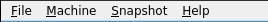
- Then click the "File" section and you will be greeted with this drop down and click the indicated selection:
    * 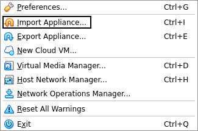
- This window will appear and proceed to click the element outlined in black:
    * 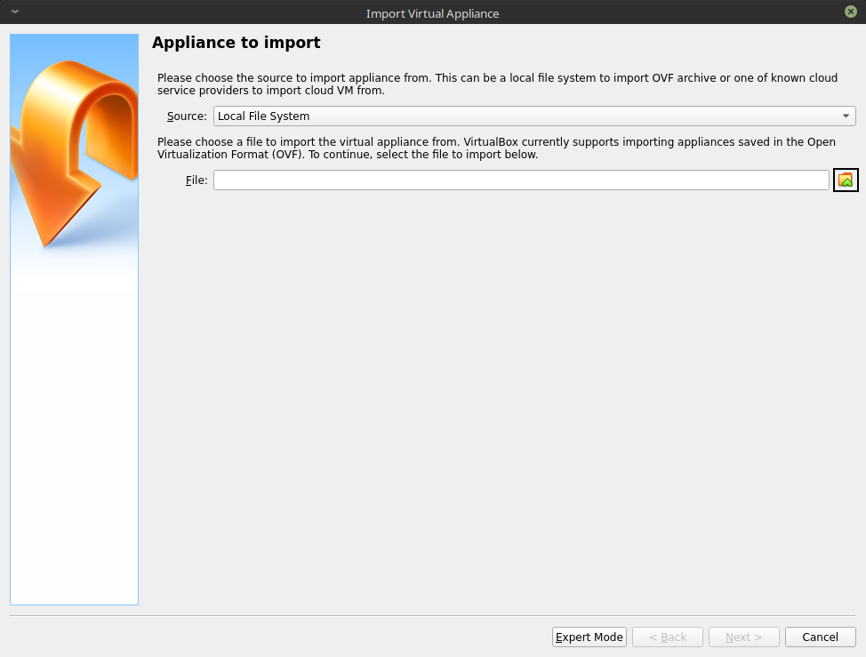
- Go to where the file has been downloaded. It generally resides in either your downloads folder or is saved to `/tmp` if you're running a Linux system. Be sure to check in your browser of choice.
    * 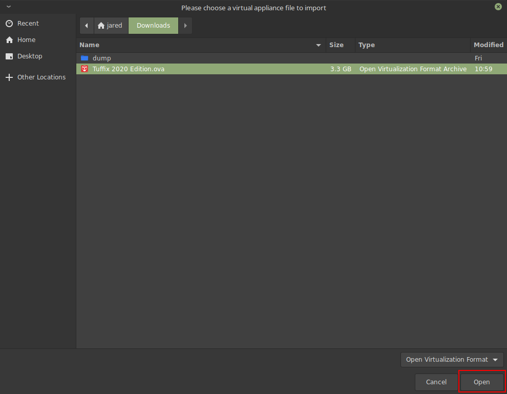
- After it has been selected, press "Next":
    * 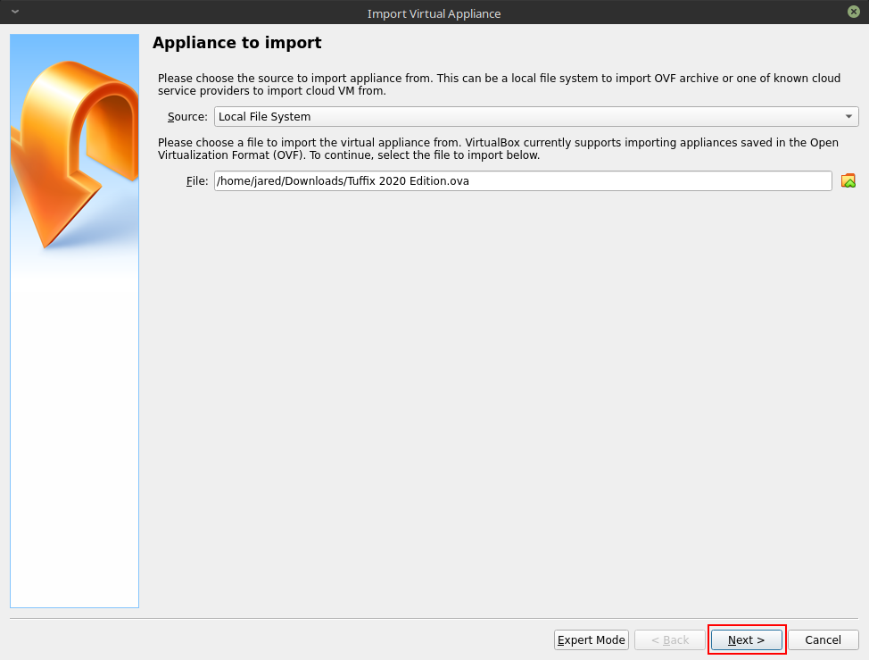
- Then proceed to import:
    * 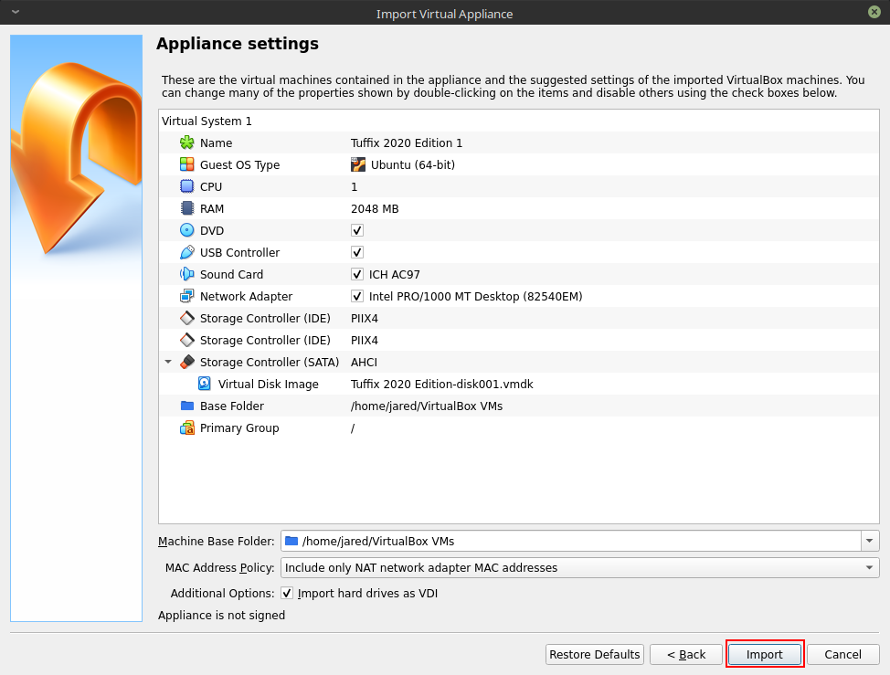
- This step will take sometime depending on your set up:
    * 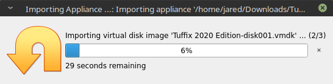
- Once it has finished importing, you will see a pane like this:
    * 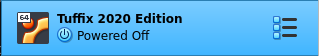
- Right click and press "Start ->":
    * 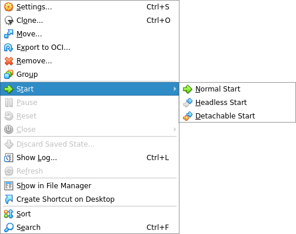
- Once fully booted up, you should see this prompt:
    * The default password is "student", all lower case
    * 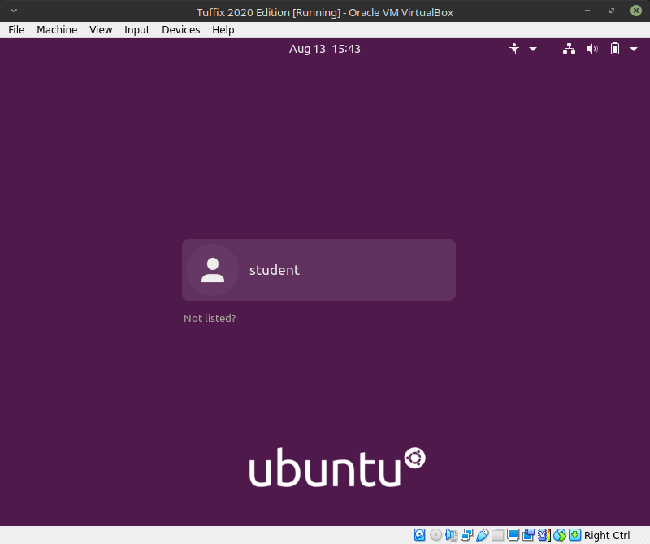
- You're all set to go from here:
    * 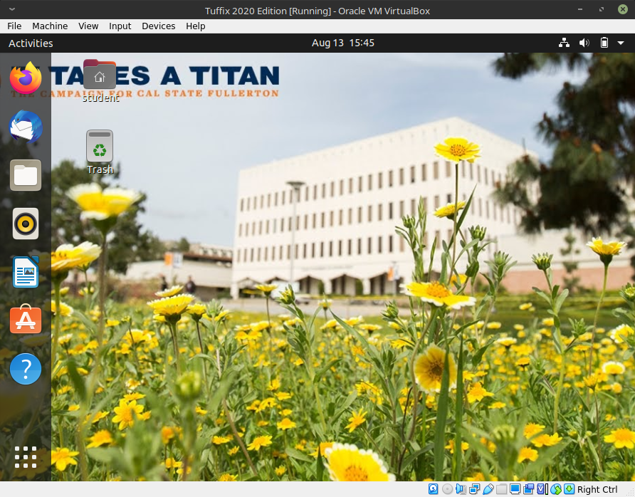
